# 🔎 Anomaly Detector — PMAY-U 2025

<p align="center">
  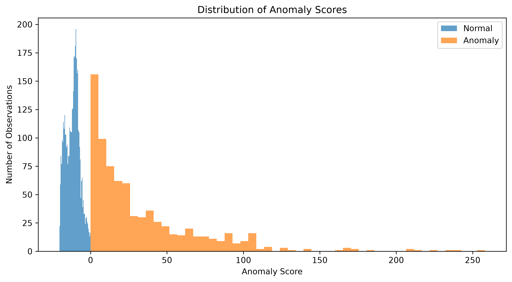
</p>

<h2 align="center">Unsupervised Anomaly Detection & Investigation Support</h2>

<p align="center">
  A research-oriented machine learning system for identifying statistically unusual observations in PMAY-U 2025 data and prioritizing them for further investigation.
</p>

<p align="center">
  <a href="https://github.com/adrijghosh8/PMAY-U-Anomaly-Detection">
    
  </a>
  
  
  
  
  
  
</p>

---

## 📖 Table of Contents

- [Overview](#-overview)
- [Key Results](#-key-results)
- [Research Objective](#-research-objective)
- [Dataset](#-dataset)
- [Exploratory Data Analysis](#-exploratory-data-analysis)
- [Preprocessing](#-preprocessing)
- [Anomaly Detection Models](#-anomaly-detection-models)
- [Model Comparison](#-model-comparison)
- [Final Model](#-final-model)
- [Anomaly Detection Results](#-anomaly-detection-results)
- [Investigation Priorities](#-investigation-priorities)
- [Anomaly Behaviour](#-anomaly-behaviour)
- [Explainability](#-explainability)
- [Top Anomaly Candidates](#-top-anomaly-candidates)
- [Interactive Dashboard](#-interactive-dashboard)
- [Research Outputs](#-research-outputs)
- [Project Structure](#-project-structure)
- [Reproducibility](#-reproducibility)
- [Testing](#-testing)
- [Limitations](#-limitations)
- [Research Contribution](#-research-contribution)
- [Future Work](#-future-work)
- [Technology Stack](#-technology-stack)
- [Author](#-author)
- [Disclaimer](#-disclaimer)

---

# 📌 Overview

**Anomaly Detector** is an unsupervised machine learning framework developed to identify **statistically unusual observations** within the PMAY-U 2025 dataset.

The system is designed as an **investigation-support framework** rather than an automated corruption-detection system.

It evaluates three unsupervised anomaly detection algorithms:

1. **Isolation Forest**
2. **Local Outlier Factor (LOF)**
3. **One-Class SVM**

Because the dataset does not contain verified ground-truth anomaly or corruption labels, the models are not evaluated using conventional supervised classification accuracy.

Instead, model selection is based on the **stability of the top-5% anomaly ranking under repeated perturbations**.

The final selected model is an **RBF-kernel One-Class SVM**.

> ⚠️ **Important:** A detected anomaly represents statistical unusualness. It does **not** establish corruption, fraud, misconduct, or wrongdoing.

---

# 📊 Key Results

| Metric | Result |
|---|---:|
| **Total Records** | **5,113** |
| **Normal Records** | **4,347** |
| **Anomaly Candidates** | **766** |
| **Anomaly Rate** | **14.98%** |
| **Final Model** | **One-Class SVM** |
| **Kernel** | **RBF** |
| **ν** | **0.15** |
| **γ** | **0.05** |
| **Observed Stability** | **1.0000** |

---

# 🎯 Research Objective

The primary objective of this project is to develop a reproducible framework capable of:

- identifying statistically unusual observations,
- comparing multiple unsupervised anomaly detection algorithms,
- selecting a model using a stability-based criterion,
- ranking observations by anomaly score,
- assigning investigation priorities,
- providing model-agnostic feature-level explanations,
- and presenting the results through an accessible analytical dashboard.

The project intentionally avoids creating domain-specific handcrafted corruption indicators.

The model uses the original numerical variables from the dataset.

---

# 🧠 Research Pipeline

```text
                         PMAY-U 2025 Dataset
                                  │
                                  ▼
                         Data Validation
                                  │
                                  ▼
                      Missing Value Handling
                                  │
                                  ▼
                    Yeo-Johnson Transformation
                                  │
                                  ▼
                           Robust Scaling
                                  │
                                  ▼
                 ┌────────────────┼────────────────┐
                 ▼                ▼                ▼
          Isolation Forest       LOF        One-Class SVM
                 │                │                │
                 └────────────────┼────────────────┘
                                  ▼
                     Stability-Based Comparison
                                  │
                                  ▼
                         Model Selection
                                  │
                                  ▼
                         Anomaly Scoring
                                  │
                                  ▼
                         Anomaly Ranking
                                  │
                                  ▼
                    Investigation Prioritization
                                  │
                                  ▼
                          Explainability
                                  │
                                  ▼
                         Research Dashboard
```

---

# 🗂️ Dataset

The project uses the **PMAY-U 2025 dataset**.

## Dataset Summary

| Property | Value |
|---|---:|
| Dataset | PMAY-U 2025 |
| Total Records | **5,113** |
| Original Columns | **10** |
| Numerical Model Features | **6** |
| Ground-Truth Anomaly Labels | **Not Available** |
| Duplicate Records | **None identified** |
| Missing Numerical Values | **Present** |

The dataset contains administrative, geographical, temporal, financial, and housing-related information.

The anomaly detection models operate on six original numerical variables.

## Dataset Features

| Feature | Type | Used by Model |
|---|---|:---:|
| Country | Categorical | ❌ |
| State | Categorical | ❌ |
| Year | Contextual | ❌ |
| City | Categorical | ❌ |
| Investment | Numerical | ✅ |
| Central Assistance Sanctioned | Numerical | ✅ |
| Central Assistance Released | Numerical | ✅ |
| Houses Sanctioned | Numerical | ✅ |
| Houses Grounded | Numerical | ✅ |
| Houses Completed | Numerical | ✅ |

### Numerical Model Features

```text
Investment
Central Assistance Sanctioned
Central Assistance Released
Houses Sanctioned
Houses Grounded
Houses Completed
```

No domain-specific ratios, handcrafted corruption indicators, or manually constructed suspicion variables are introduced.

---

# 🔬 Exploratory Data Analysis

The numerical variables exhibit substantial right-skewness and extreme observations.

## Investment Distribution

<p align="center">
  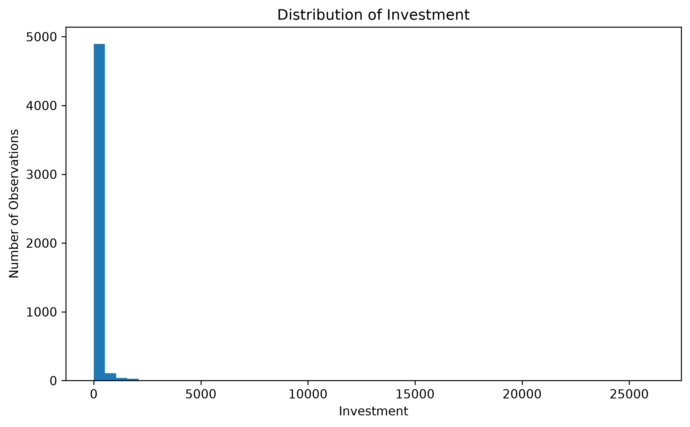
</p>

## Central Assistance Sanctioned

<p align="center">
  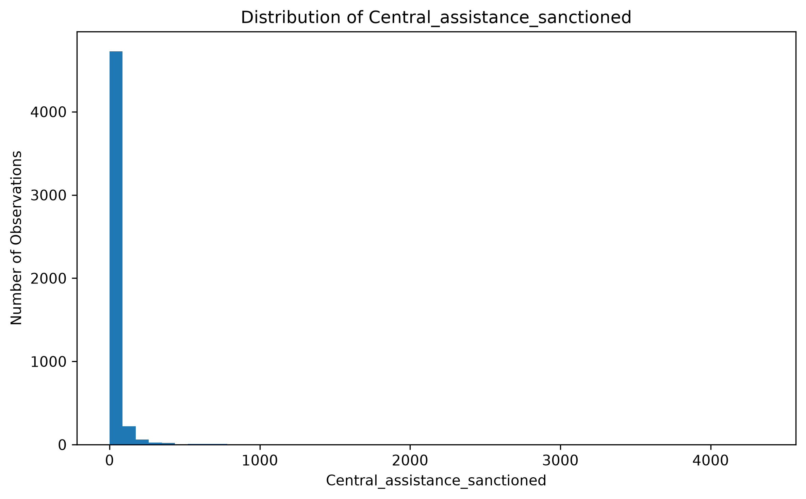
</p>

## Central Assistance Released

<p align="center">
  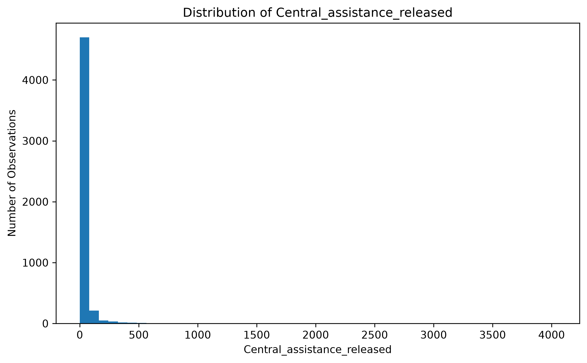
</p>

## Houses Sanctioned

<p align="center">
  
</p>

## Houses Grounded

<p align="center">
  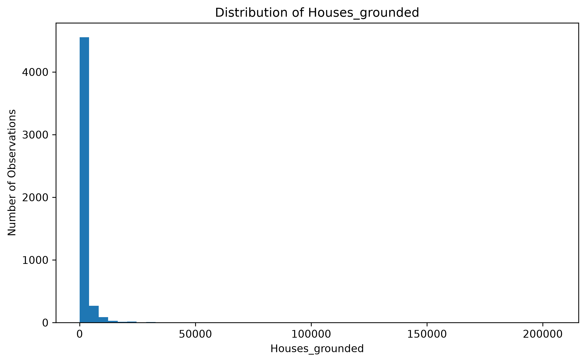
</p>

## Houses Completed

<p align="center">
  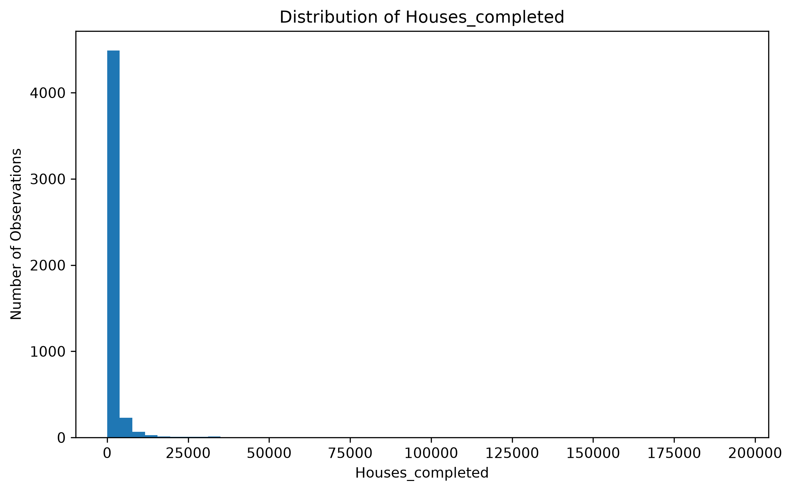
</p>

---

## Missing Values

<p align="center">
  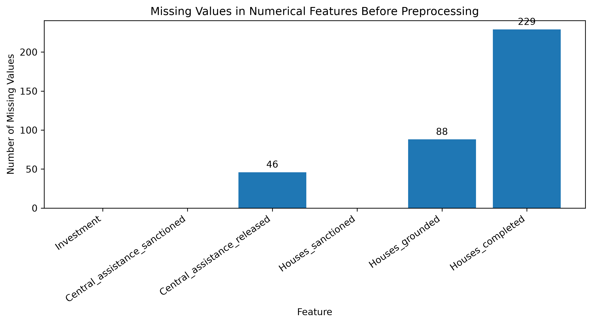
</p>

Missing numerical observations are handled using **median imputation** during preprocessing.

Missing values are not automatically interpreted as zero.

---

## Feature Correlation

<p align="center">
  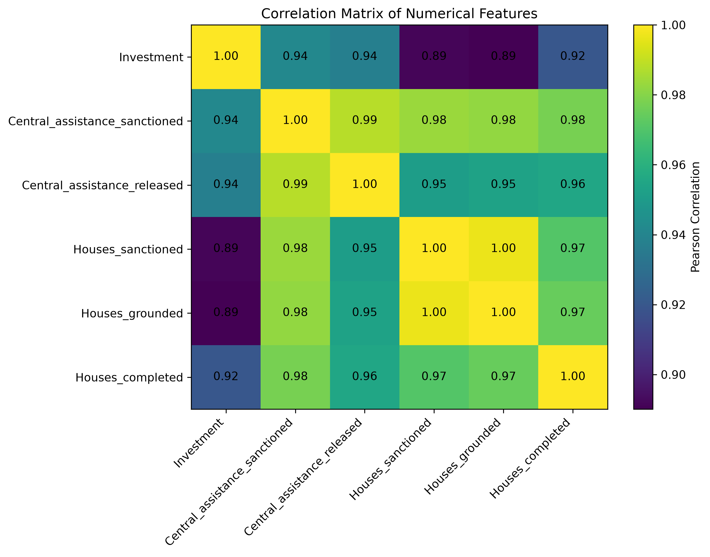
</p>

The numerical variables exhibit strong correlations and redundancy. This motivated the use of distribution transformation and robust scaling before anomaly detection.

---

# ⚙️ Preprocessing

The final preprocessing pipeline consists of three stages.

| Stage | Method | Purpose |
|---|---|---|
| Missing Value Handling | **Median Imputation** | Handle missing numerical observations |
| Distribution Transformation | **Yeo-Johnson** | Reduce the effect of skewed distributions |
| Feature Scaling | **RobustScaler** | Provide robust scaling in the presence of extreme observations |

### Pipeline

```text
Raw Numerical Features
        │
        ▼
Median Imputation
        │
        ▼
Yeo-Johnson Transformation
        │
        ▼
Robust Scaling
        │
        ▼
Model-Ready Features
```

The fitted preprocessing pipeline is stored as a model artifact and reused consistently.

---

# 🤖 Anomaly Detection Models

Three unsupervised algorithms were evaluated.

## Isolation Forest

Isolation Forest identifies observations that are easier to isolate from the rest of the dataset.

## Local Outlier Factor

Local Outlier Factor identifies observations whose local density differs substantially from their neighbouring observations.

## One-Class SVM

One-Class SVM learns a boundary around the reference data and identifies observations that fall outside the learned boundary.

The final model uses an RBF kernel.

---

# 📈 Model Comparison

Because there are no verified anomaly labels in the dataset, conventional supervised metrics such as accuracy, precision, recall, and F1-score cannot be interpreted as ground-truth anomaly-detection performance measures.

Instead, this project uses **top-5% anomaly ranking stability under repeated perturbations**.

The goal is to determine whether a model consistently identifies similar high-priority observations when the reference data is slightly perturbed.

## Stability Comparison

<p align="center">
  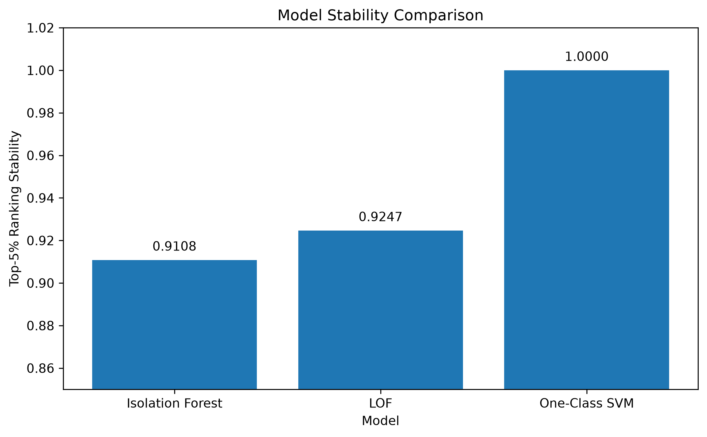
</p>

| Model | Best Configuration | Stability |
|---|---|---:|
| **Isolation Forest** | 300 estimators, max samples = 0.8 | **0.9108** |
| **LOF** | 75 neighbors | **0.9247** |
| **One-Class SVM** | ν = 0.10, γ = 0.10 | **0.9846** |

An extended One-Class SVM search identified:

```text
Kernel = RBF
ν      = 0.15
γ      = 0.05
```

with an observed stability of:

```text
1.0000
```

> **Interpretation:** A stability score of 1.0000 means that the top-5% anomaly ranking remained unchanged across the tested perturbation runs. It does **not** mean that the model has 100% accuracy.

---

# ⭐ Final Model

## One-Class SVM

The final selected model is:

| Parameter | Value |
|---|---|
| Algorithm | **One-Class SVM** |
| Kernel | **RBF** |
| ν | **0.15** |
| γ | **0.05** |
| Selection Criterion | Ranking Stability |
| Observed Stability | **1.0000** |

The model was selected based on ranking stability because the dataset does not provide ground-truth anomaly labels.

---

# 🚨 Anomaly Detection Results

After model selection, the selected One-Class SVM was refitted on the complete dataset.

| Category | Records |
|---|---:|
| **Total Records** | **5,113** |
| **Normal** | **4,347** |
| **Anomaly Candidates** | **766** |
| **Anomaly Rate** | **14.98%** |

## Anomaly Score Distribution

<p align="center">
  
</p>

The system assigns every observation an anomaly score.

**Higher anomaly scores indicate observations that are more statistically unusual according to the selected model.**

The score should be interpreted as a ranking signal rather than a probability of corruption.

---

# 🎯 Investigation Priorities

The final anomaly ranking is divided into investigation-priority levels.

| Priority | Ranking Range | Meaning |
|---|---|---|
| 🔴 **Critical** | Top 1% | Highest investigation priority |
| 🟠 **High** | Top 5% | High investigation priority |
| 🟡 **Moderate** | Top 10% | Moderate investigation priority |
| ⚪ **Low** | Remaining observations | Lower investigation priority |

These categories are designed to help analysts focus attention efficiently.

> **Priority ≠ Probability of Corruption**

---

# 🔎 Anomaly Behaviour

<p align="center">
  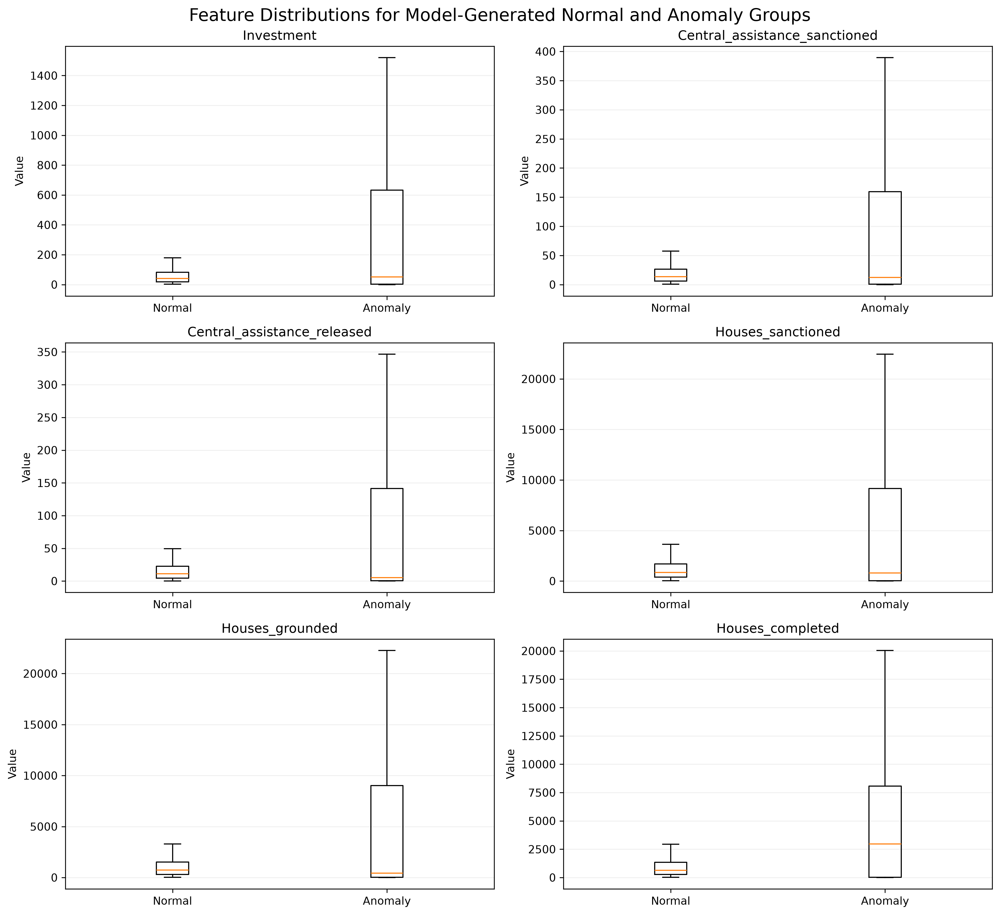
</p>

The model-generated anomaly group occupies broader and more extreme regions of several numerical feature distributions.

This analysis is a **post-hoc description of model-generated groups**.

It should not be interpreted as an independent measure of model accuracy.

---

# 🧠 Explainability

The system uses a **model-agnostic one-feature-at-a-time median perturbation method**.

For a selected anomaly:

```text
Original Observation
        │
        ▼
Calculate Original Anomaly Score
        │
        ▼
Replace One Feature with Reference Median
        │
        ▼
Calculate Modified Anomaly Score
        │
        ▼
Measure Score Change
        │
        ▼
Repeat for Each Numerical Feature
```

This provides an indication of which features have the greatest influence on the model's anomaly score.

> Feature influence is **diagnostic, not causal**.

## Feature Influence

<p align="center">
  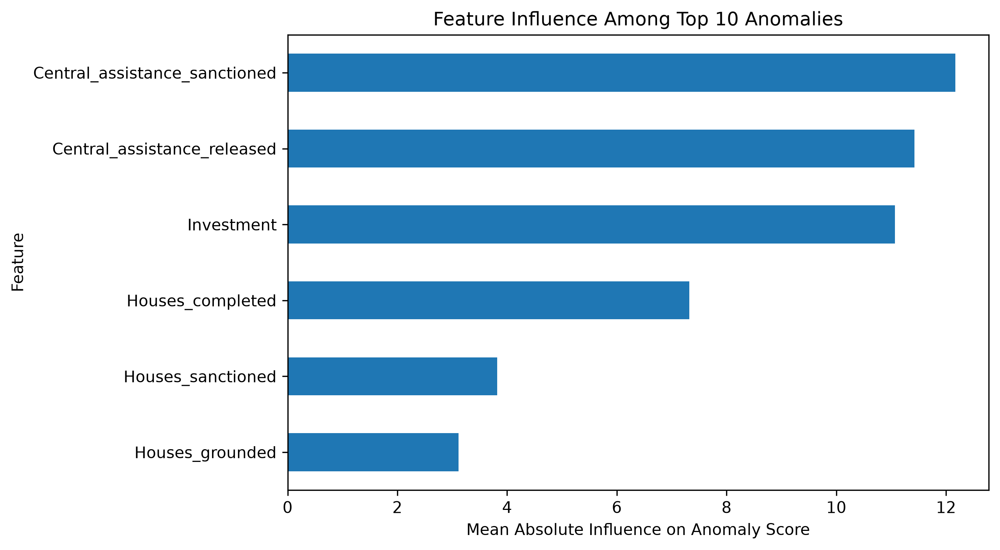
</p>

| Feature | Mean Influence |
|---|---:|
| Central Assistance Sanctioned | **12.1693** |
| Central Assistance Released | **11.4269** |
| Investment | **11.0688** |
| Houses Completed | **7.3211** |
| Houses Sanctioned | **3.8193** |
| Houses Grounded | **3.1168** |

The influence values represent the magnitude of anomaly-score change under the perturbation procedure.

---

# 🏙️ Top Anomaly Candidates

The highest-ranked observations include several large municipal and corporation records.

| Rank | City | State | Anomaly Score | Priority |
|---:|---|---|---:|---|
| **1** | Ahmedabad Municipal Corporation | Gujarat | **258.063** | Critical |
| **2** | Surat Municipal Corporation | Gujarat | **240.158** | Critical |
| **3** | Pune Municipal Corporation | Maharashtra | **236.607** | Critical |
| **4** | Hyderabad Municipal Corporation | Telangana | **225.771** | Critical |
| **5** | Visakhapattnam Municipal Corporation | Andhra Pradesh | **216.630** | Critical |

These observations are **statistical anomaly candidates**.

They are not confirmed cases of corruption or wrongdoing.

---

# 📊 Example Interpretation

Consider a high-ranked anomaly.

The system does not ask:

> "Is this record corrupt?"

Instead, it asks:

> "How unusual is this observation relative to the distribution learned from the available data?"

The result can then be used to prioritize the observation for further human or administrative investigation.

---

# 🖥️ Interactive Dashboard

The project includes a modern web-based visualization interface for exploring the research results.

The dashboard presents the analysis through several sections.

## Dashboard Sections

| Section | Purpose |
|---|---|
| **Overview** | High-level project and detection summary |
| **Dataset** | Dataset characteristics and feature information |
| **Model Comparison** | Comparison of the three anomaly detection algorithms |
| **Anomaly Analysis** | Score distributions and anomaly behaviour |
| **Top Anomalies** | Ranked anomaly candidates |
| **Explainability** | Feature-level anomaly explanations |
| **Methodology** | Complete research methodology and limitations |

## Dashboard Features

- 📊 Dataset statistics
- 📈 Research visualizations
- 🤖 Model comparison
- 🚨 Anomaly rankings
- 🎯 Investigation priorities
- 🔎 Searchable anomaly candidates
- 🧠 Feature-level explanations
- 📋 Research tables
- 📚 Methodology documentation

---

# 📁 Research Outputs

The project produces structured research artifacts that can be used for analysis, evaluation, and research-paper preparation.

## Final Results

```text
research/
└── experiments/
    └── results/
        ├── final_anomaly_report.csv
        ├── top20_anomalies.csv
        ├── top10_anomaly_explanations.csv
        └── feature_influence_summary.csv
```

## Research Tables

```text
research/
└── reports/
    └── tables/
        ├── table1_dataset_summary.csv
        ├── table2_model_comparison.csv
        ├── table3_detection_summary.csv
        ├── table4_top20_anomaly_candidates.csv
        ├── table5_anomaly_vs_normal_statistics.csv
        └── table6_state_anomaly_distribution.csv
```

## Research Figures

```text
research/
└── reports/
    └── figures/
        ├── model_stability_comparison.png
        ├── anomaly_score_distribution.png
        ├── anomaly_vs_normal_feature_distributions.png
        ├── feature_influence_top10.png
        ├── missing_values_before_preprocessing.png
        ├── numerical_feature_correlation.png
        ├── investment_distribution.png
        ├── central_assistance_sanctioned_distribution.png
        ├── central_assistance_released_distribution.png
        ├── houses_sanctioned_distribution.png
        ├── houses_grounded_distribution.png
        ├── houses_completed_distribution.png
        ├── state_anomaly_rates.png
        └── top20_anomaly_candidates.png
```

---

# 📦 Model Artifacts

The trained model and preprocessing pipeline are stored for reproducibility.

```text
models/
├── final_preprocessor.joblib
└── final_one_class_svm.joblib
```

The preprocessing artifact ensures that future observations can be transformed using the same preprocessing procedure used during model development.

---

# 🏗️ Project Structure

```text
PMAY-U-Anomaly-Detection/
│
├── data/
│
├── experiments/
│   ├── configs/
│   ├── results/
│   └── figures/
│
├── models/
│
├── reports/
│   ├── figures/
│   └── tables/
│
├── research/
│
├── scripts/
│
├── src/
│   ├── data/
│   ├── models/
│   ├── explainability/
│   └── utils/
│
├── tests/
│
├── public/
│   └── figures/
│
├── frontend/
│   ├── src/
│   ├── public/
│   ├── research/
│   ├── scripts/
│   ├── package.json
│   └── vite.config.js
│
├── run_pipeline.py
├── config.yaml
├── requirements.txt
├── pytest.ini
├── README.md
└── RESEARCH_NOTES.md
```

---

# 🧪 Reproducibility

## 1. Clone the Repository

```bash
git clone https://github.com/adrijghosh8/PMAY-U-Anomaly-Detection.git
cd PMAY-U-Anomaly-Detection
```

## 2. Create a Python Virtual Environment

```bash
python -m venv .venv
```

### Windows PowerShell

```powershell
.\.venv\Scripts\Activate.ps1
```

## 3. Install Python Dependencies

```bash
pip install -r requirements.txt
```

## 4. Run the Main Pipeline

```bash
python run_pipeline.py
```

## 5. Generate Research Tables

```bash
python generate_research_tables.py
```

## 6. Generate Anomaly Behaviour Analysis

```bash
python analyze_anomaly_behavior.py
```

## 7. Generate State-Level Analysis

```bash
python analyze_state_distribution.py
```

## 8. Run Automated Tests

```bash
pytest
```

Current test status:

```text
14 tests passed
```

---

# 🌐 Frontend Development

The interactive dashboard is built using **React + Vite**.

Navigate to the frontend directory:

```bash
cd frontend
```

Install dependencies:

```bash
npm install
```

Start the development server:

```bash
npm run dev
```

Build the production version:

```bash
npm run build
```

---

# 🧪 Testing

The project includes automated tests covering important parts of the anomaly detection pipeline.

Tests cover:

- Feature validation
- Missing-value handling
- Preprocessing
- Model configuration
- Anomaly prediction
- Result structure
- Detection counts
- Anomaly ranking
- Model artifacts

### Current Status

```text
14 / 14 tests passing
```

---

# ⚠️ Limitations

The current research prototype has several important limitations.

## 1. No Ground-Truth Anomaly Labels

The dataset does not contain verified anomaly or corruption labels.

Therefore, supervised accuracy metrics cannot be used as direct evidence of anomaly-detection performance.

## 2. Statistical Anomaly ≠ Corruption

A high anomaly score means that an observation is statistically unusual according to the model.

It does not prove:

- corruption,
- fraud,
- misconduct,
- manipulation,
- administrative wrongdoing,
- or data falsification.

## 3. Stability ≠ Accuracy

The stability-based selection method measures the consistency of anomaly rankings under perturbations.

It does not measure real-world detection accuracy.

## 4. Dataset Dependence

The results depend on:

- the dataset,
- preprocessing pipeline,
- model configuration,
- feature distributions,
- and the selected anomaly detection methodology.

## 5. Extreme Observations

Observations with extreme numerical magnitudes may receive high anomaly scores because of their statistical position in the dataset.

This means that unusually large legitimate observations may also appear among high-ranked anomaly candidates.

## 6. Explainability Limitations

Feature influence is estimated using controlled feature perturbations.

It is useful for understanding model behaviour, but it should not be interpreted as causal evidence.

## 7. Human Verification

Any observation flagged by the system should undergo appropriate human, administrative, or domain-specific verification before conclusions are drawn.

---

# 🎓 Research Contribution

This project demonstrates a reproducible framework for applying unsupervised anomaly detection to a large-scale public-sector dataset.

The framework integrates:

```text
Data Quality Analysis
        ↓
Robust Preprocessing
        ↓
Multi-Model Comparison
        ↓
Stability-Based Model Selection
        ↓
Anomaly Scoring
        ↓
Anomaly Ranking
        ↓
Investigation Prioritization
        ↓
Model-Agnostic Explainability
        ↓
Interactive Visualization
```

The main contribution is a structured approach for transforming unsupervised anomaly detection outputs into an **investigation-support workflow**.

The system does not attempt to automatically determine whether an observation is corrupt.

Instead, it provides analysts with a way to identify statistically unusual observations and prioritize them for further examination.

---

# 🚀 Future Work

Potential future extensions include:

- Evaluation against verified investigation outcomes
- Temporal anomaly detection
- Additional unsupervised algorithms
- Ensemble anomaly scoring
- Human-in-the-loop investigation workflows
- Real-time API-based inference
- Integration with additional public-sector datasets
- Larger longitudinal datasets
- External validation using independently verified cases

---

# 🛠️ Technology Stack

| Category | Technology |
|---|---|
| Programming Language | Python |
| Data Processing | Pandas, NumPy |
| Machine Learning | Scikit-learn |
| Numerical Processing | SciPy |
| Model Persistence | Joblib |
| Visualization | Matplotlib |
| Configuration | YAML |
| Testing | Pytest |
| Frontend | React |
| Frontend Build Tool | Vite |
| Package Management | npm |

---

# 📌 Interpretation Guide

The most important interpretation rule of this project is:

> **Anomaly detection identifies statistical unusualness, not corruption.**

A high anomaly score should be interpreted as:

**"This observation deserves closer examination."**

It should not be interpreted as:

**"This observation is corrupt."**

This distinction is fundamental to the responsible use of unsupervised anomaly detection in public-sector data analysis.

---

# 📜 Disclaimer

This project is an **academic research prototype**.

The anomaly scores, rankings, feature influences, and investigation priorities generated by this system are intended for analytical and investigative prioritization only.

**Anomaly detection does not establish corruption, fraud, misconduct, or wrongdoing.**

Any real-world conclusion must be supported by independent evidence, appropriate domain knowledge, and human investigation.

---

# 👨‍💻 Author

## Adrij Ghosh

GitHub:

https://github.com/adrijghosh8/PMAY-U-Anomaly-Detection

---

# ⭐ Project Status

**Research Prototype — PMAY-U 2025**


---

<p align="center">

## 🔎 ANOMALY DETECTOR

### PMAY-U 2025

<i>Identify unusual patterns. Prioritize investigation. Preserve human judgment.</i>

</p>
